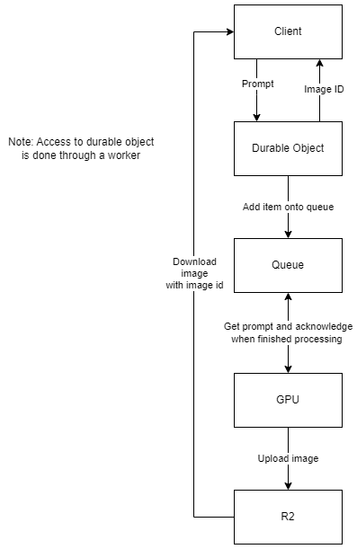

# Scaling image generation experiment

## This is an experiment. Use at your own risk

A basic cloud computing architecture costs to much to run image generation.

## The cost of a basic architecture

An example of a basic cloud computing architecture hosted on AWS in a single region:
- One load balancer 
- Two nodes

We make the following assumptions:
- One month has 30 days
- Architecture is always running at full load
- Running SDXL inference at 24 steps for image generation
- Load balancer is an application load balancer
- Nodes are on-demand g4dn.xlarge instances
- Generating 1024x1024 images
- A 1024x1024 image is 1 MB
- Data transfer from AWS to Internet is billed at $0.09 per GB
- USD currency
- EBS is not calculated

We calculate the amount images created:
- A g4dn.xlarge instance has a Nvidia T4 GPU
- One T4 takes 21 seconds per image
- One T4 generates ~123,000 images a month
- Two T4s generates ~246,000 images a month

We calculate the cost of the load balancer:
- Note: The pricing of a application load balancer is too confusing. Only going to worry about fixed rate and processed bytes
- Fixed hourly rate of $16.43
- 246 GB of processed data costs $1.98
- Total monthly cost: $18.41

We calculate the cost of running the nodes:
- A g4dn.xlarge on-demand instance costs $0.526/hour
- A node costs $378.72 a month
- Total monthly cost: $757.44

We calculate the cost of outbound data transfer:
- 246 GB of outbound data transfer
- Total monthly cost: $22.14

We calculate the cost of running this architecture:
- Total monthy cost: $797.99

## The cost of a better architecture

An example of a better architecture hosted on AWS in a single region:

todo: show that durable objects and gpu can scale



Definitions:
- Durable Object: [Cloudflare Durable Objects](https://developers.cloudflare.com/durable-objects/)
- Queue: [Cloudflare Queues](https://developers.cloudflare.com/queues/)
- GPU: inf2.xlarge AWS EC2 instance
- R2: [Cloudflare R2](https://developers.cloudflare.com/r2/)

We make the following assumptions:
- One month has 30 days
- Architecture is always running at full load
- Running SDXL inference at 12 steps with [Hyper-SDXL-12steps-CFG-LoRA](https://huggingface.co/ByteDance/Hyper-SD) for image generation
- Nodes are spot inf2.xlarge instances
- Generating 1024x1024 images
- A 1024x1024 image as latents is 260 KB
- Data transfer from AWS to Internet is billed at $0.09 per GB
- USD currency
- EBS is not calculated
- Two nodes are always on
- Use inf2.xlarge spot price from EU (Stockholm) as of 09/06/24
- Cloudflare products costs are negligible and are not included (except for R2 if it isn't periodically cleaned)

We calculate the amount images created:
- A inf2.xlarge instance has 2 NeuronCore-v2 cores [(source)](https://awsdocs-neuron.readthedocs-hosted.com/en/latest/general/arch/neuron-hardware/inferentia2.html)
- A node takes 3 seconds per image
- A node generates ~864,000 images a month
- 2 nodes generate ~1,728,000 images a month

We calculate the cost of running the nodes:
- A inf2.xlarge spot instance costs $0.0971
- A node costs $69.912 a month
- Total monthly cost: $139.82

We calculate the cost of outbound data transfer:
- 450 GB of outbound data transfer
- Total monthly cost: $40.50

We calculate the cost of running this architecture:
- Total monthy cost: $180.32

The better architecture example source code is in the compute folder. inf2.xlarge runs ```compute/backend/run.sh```. Cloudflare products are used in a Cloudflare worker in ```compute/frontend/```.

An example client for the better architecture example is written as a comfy ui custom node in ```client/```.

## Notes
- You can run the basic architecture with spot instances, however:
    - If an instance is terminated then prompts queued on that instance will be lost
    - You may want to use multiple regions to stay operational which means paying for the load balancer fixed price more than once
- You can return images instead of latents in the better architecture, but it will have a total monthly outbound data transfer of 1,728 GB which will cost $155.52 a month
- The better architecture is not bound by a cloud provider's virtual network. A cloudflare queue can be pulled from the internet opening the possibility to crowdsourced compute (could be especially useful for VAE decode)
- SD-Hyper for distillation was chosen, but SDXL-Lightning could be better
- SD-Hyper 12 steps was chosen by trying out each variant:
    - 1 step produced images that were full of artifacts
    - 2 steps produced uncanny images
    - 4 steps produced images with a 16/50 correct anatomy rate
    - 8 steps (CFG) produced images with 30/50 correct anatomy rate
    - 12 steps (CFG) produced images with 37/50 correct anatomy rate
    - Full model at 24 steps produced images with 42/50 correct anatomy rate
- The CFG scale doesn't seem to affect the correct anatomy rate
- The correct anatomy rate being the number of images which had correct anatomy
- Running SD-Hyper 12 steps through ONNX had no speed up when compared to pytorch
- Running SD-Hyper 12 steps through TensorRT had no speed up when compared to pytorch

### Nvidia int-8 quantisation

- Running Nvidia's closed source SDXL 8-bit quantisation [(article)](https://developer.nvidia.com/blog/tensorrt-accelerates-stable-diffusion-nearly-2x-faster-with-8-bit-post-training-quantization/) at 24 steps had speed up when compared to pytorch
- Note that making Nvidia's code on the article is a pain (it uses deprecated package nvidia-ammo). Use [TensorRT-Model-Optimizer](https://github.com/NVIDIA/TensorRT-Model-Optimizer/tree/main/diffusers) which uses nvidia-modelopt instead (it is just the same thing renamed)
- Note that TensorRT-Model-Optimizer requires a bit of tinkering to load a custom model
- Note that running TensorRT-Model-Optimizer requires lots of RAM, VRAM, and time to generate the model. A Standard_NC24ads_A100_v4 Azure instance works (220 GiB RAM and 80 GiB VRAM)
- Nvidia's closed source SDXL 8-bit quantisation running at 12 steps had no speed up when compared to pytorch
